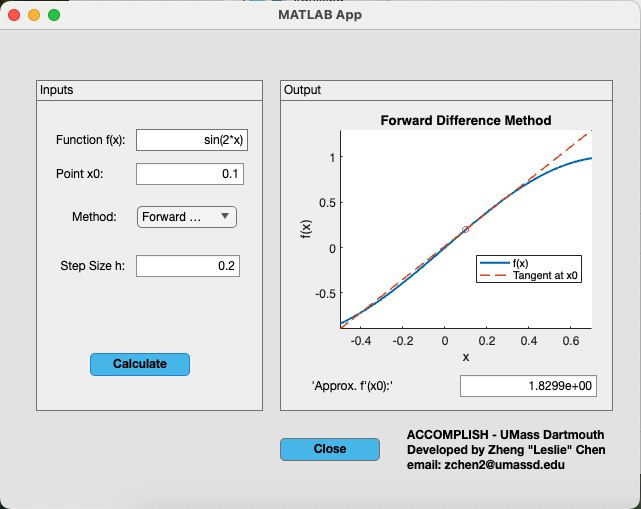

[Dr. Zheng Chen](https://lesliechenz.github.io/webpage/), Mathematics Department, University of Massachusetts Dartmouth

## Goal  

In this module, students will finish building a MATLAB App Designer application that approximates derivatives of arbitrary functions. Starting from the provided template (`Numerical_Differentiation_App.mlapp`), they will implement all finite‑difference algorithms in the `numerical_differentiation.m` file.  

  

## Contents
- "GUI_differentiation_student": Contains the app file and a version of the source code function with blank blocks for students to complete as part of the assignment.
- "GUI_differentiation_complete": Intended for the advisor, with the app file and the completed source code function.
- "ACCOMPLISH - Numerical Differentiation.pdf" PDF version of this README.

## Overview of the GUI  
1. **User inputs**  
   - **Function:** Enter the formula, for example `f(x) = sin(x)`  
   - **Evaluation Point:** Specify the value of $x_0$  
   - **Method:** Select a finite‑difference formula from the drop‑down menu 

2. **App framework**  
   - **Starter File:** `Numerical_Differentiation_App.mlapp`   
   - **Algorithm Library:** All differentiation routines are implemented as separate functions in `numerical_differentiation.m` 
   - **Instructor Version:** A complete app (with working code) is provided to the advisor only  

3. **Student assignment**  
   - Review the mathematical background for each finite‑difference formula  
   - Fill in the missing code blocks in `numerical_differentiation.m`  
   - Detailed guidance and derivations will be provided in the sections that follow

## MATLAB GUI Resources  
- **App Designer YouTube tutorial (recommended)**  
  https://youtu.be/nb0jHVXKY2w  
- **App Designer documentation**  
  https://www.mathworks.com/help/matlab/app-designer.html
- **Create and Run a Simple App Using App Designer tutorial**  
  https://www.mathworks.com/help/matlab/creating_guis/create-a-simple-app-or-gui-using-app-designer.html
- **MATLAB App Designer product page**  
  https://www.mathworks.com/products/matlab/app-designer.html

## Included Differentiation Methods  
Students will implement these finite‑difference formulas:  
- **Two‑point formulas**
  - Forward‑difference
  - Backward‑difference  
- **Three‑point formulas**  
- **Five‑point formulas**  
- **Second‑derivative midpoint formula**  (optional)

---

*Next, we will provide mathematical derivations and coding hints for each method so you can seamlessly integrate them into the GUI.*  

# Table of Contents

To approximate $f'(x_0)$:
- [Two‑point formulas](#Two‑point_formulas)
- [Three‑point formulas](#Three‑point_formulas)
- [Five‑point formulas](#Five‑point_formulas)

To approximate $f''(x_0)$ (optional):
- [Second‑derivative midpoint formula](#Second‑derivative_midpoint_formula)

## Two‑point_formulas

### Derivation
- **Forward‑difference**: From the Taylor expansion of $f(x_0 + h)$, we have  
$$f(x_0 + h) = f(x_0) + h\,f'(x_0) + O(h^2)\,.$$
  Rearranging gives  
$$f'(x_0)\;\approx\;\frac{f(x_0 + h) - f(x_0)}{h} + O(h)\,,$$
  a first‑order accurate formula.

- **Backward‑difference**: Similarly, expanding $f(x_0 - h)$ yields  
$$f(x_0 - h) = f(x_0) - h\,f'(x_0) + O(h^2)\,,$$
  so  
$$f'(x_0)\;\approx\;\frac{f(x_0) - f(x_0 - h)}{h} + O(h)\,,$$
  also first‑order accurate.

### Coding hints
- Inside your `Calculate_pushbutton_Callback`, branch on `handles.Method` to distinguish forward vs. backward.
- For **forward**, you will need `f(x0 + h)` and `f(x0)`.  
- For **backward**, you will need `f(x0)` and `f(x0 – h)`.  
- Compute the difference of those two values and then divide by `h`.  

## Three‑point_formulas

### Derivation
- **Central‑difference**: Using Taylor series for $f(x_0 \pm h)$ and subtracting gives  $$f'(x_0)\;\approx\;\frac{f(x_0 + h) - f(x_0 - h)}{2h} + O(h^2)\,,$$a second‑order accurate midpoint formula.

- **Endpoint (forward/backward)**: At boundaries, the three‑point endpoint formula is  
$$f'(x_0)\;\approx\;\frac{-3f(x_0) + 4f(x_0 + h) - f(x_0 + 2h)}{2h} + O(h^2)$$
  (and its backward analogue).

### Coding hints
- Branch on the three sub‑methods (central, forward‑endpoint, backward‑endpoint).
- **Central** uses `f(x0 + h)` and `f(x0 – h)`.  
- **Endpoint** uses three sample points: at `x0`, at one step away (`±h`), and at two steps away (`±2*h`).  
- Combine those three function values with the weights from the derivation, then divide by `2*h`.  

## Five‑point_formulas

### Derivation
The fourth‑order accurate central five‑point formula comes from combining Taylor expansions at $x_0 \pm h$ and $x_0 \pm 2h$ to cancel lower‑order error terms:
 $$f'(x_0)\;\approx\;\frac{f(x_0 - 2h) \;-\; 8\,f(x_0 - h) \;+\; 8\,f(x_0 + h) \;-\; f(x_0 + 2h)}{12\,h}\;+\;O(h^4).$$

### Coding hints
- This central formula requires four off‑grid evaluations: `x0 ± h` and `x0 ± 2*h`, plus `x0` itself (if you verify consistency).
- Look back at the derivation to pick the four coefficients $\{1,\,-8,\,8,\,-1\}$.
- Form the weighted sum of those four `f(...)` calls and divide by `12*h`.  

## Second‑derivative_midpoint_formula

### Derivation
- From the Taylor expansions at $x_0 \pm h$, the second‐derivative midpoint formula is  
$$f''(x_0)\;\approx\;\frac{f(x_0 + h)\;-\;2\,f(x_0)\;+\;f(x_0 - h)}{h^2}\;+\;O(h^2).$$

### Coding hints
- Evaluate the function at `x0 + h`, `x0`, and `x0 - h` to obtain the three sample values. 
- Multiply these values by the weights $\{1, –2, 1\}$ to form the numerator of the approximation. 
- Divide the weighted sum by $h^2$ to compute the second‐derivative estimate. 
- Store the result in its own variable (for example, `secondDerivative`) to keep it separate from any first‐derivative outputs. 
